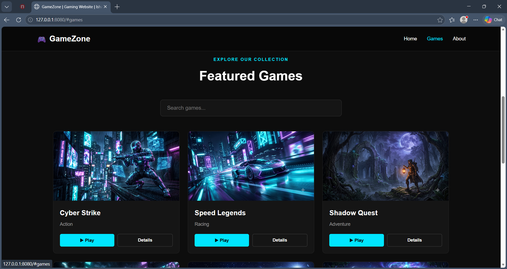

# 🎮 Simple Gaming Website

## 📌 Week 4 – Web Development Internship

This project was developed as part of the **Web Development Internship at DG Interns Hub**.

The objective of this week was to build a simple, clean, and interactive gaming website using **HTML, CSS, and JavaScript**, without a backend.

---

## 🎯 Project Objective

The goal was to create a basic gaming website containing:

* 🏠 Home section
* 🎮 Games section
* 🕹️ Multiple game cards
* 🔎 Search functionality
* ▶️ Play button interaction
* 📋 Game details section
* 🌙 Dark gaming-themed interface

---

## 🛠️ Technologies Used

* HTML5
* CSS3
* JavaScript
* GitHub Pages

---

## ✨ Features

### 🎮 Game Cards

The website contains six game cards with:

* Game image
* Game name
* Play button

### ▶️ Play Button Interaction

When the user clicks the **Play** button, JavaScript displays:

```text
Game is starting...
```

### 📋 Game Details

Clicking a game displays additional information including:

* Game name
* Description
* Category

### 🔎 Search Feature

A search box allows users to filter the available games using JavaScript.

### 🌙 Dark Theme

The website uses a dark gaming-inspired interface with a clean layout and interactive elements.

---

## 📂 Project Structure

```text
Week-4-Web-Development/
│
├── images/
│   ├── game1.png
│   ├── game2.png
│   ├── game3.png
│   ├── game4.png
│   ├── game5.png
│   └── game6.png
│
├── index.html
├── style.css
├── script.js
└── README.md
```

---

## 📸 Project Preview



---

## 🌐 Live Project

[View Live Gaming Website](https://ishanya-jha.github.io/DG-Interns-Hub/Week-4-Web-Development/)

---

## 📁 GitHub Repository

[View Week 4 Source Code](https://github.com/Ishanya-Jha/DG-Interns-Hub/tree/main/Week-4-Web-Development/index.html)

---

## 🧠 Concepts Learned

Through this project, I practiced:

* HTML page structure
* CSS styling and layouts
* Dark theme design
* JavaScript DOM manipulation
* Event handling
* Button click interactions
* Search and filtering
* Dynamic content display
* Basic frontend project organization

---

## 🎓 Internship Learning Outcome

This project helped strengthen my understanding of building interactive frontend websites using JavaScript. I learned how user actions such as clicking buttons and searching for games can dynamically change the content displayed on a webpage.

---

## 👨‍💻 Developer

**Ishanya Jha**

**Web Development Intern – DG Interns Hub**

**Batch:** 1 August

**Intern ID:** DG/AUGUST/WEB/037
