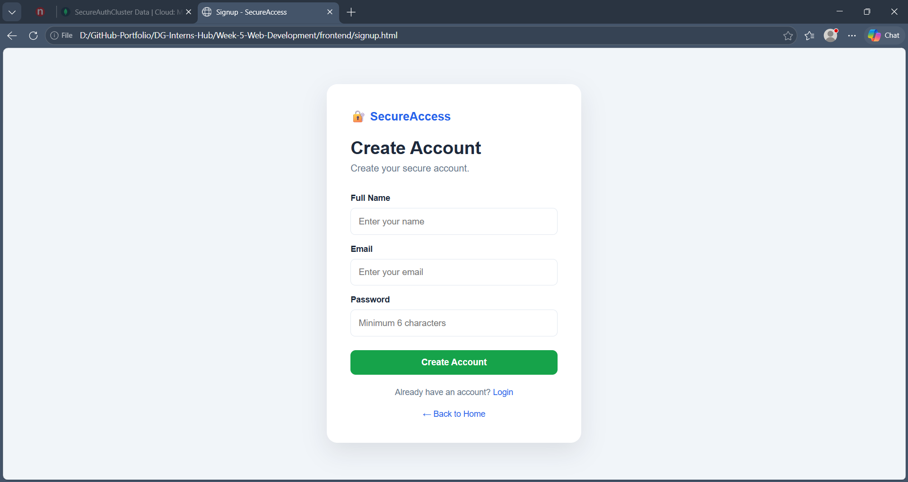
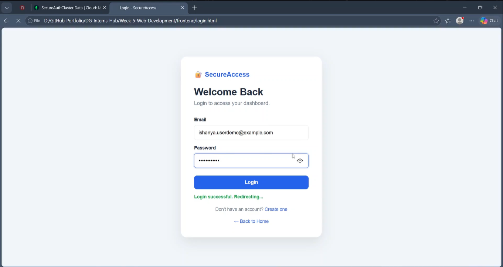
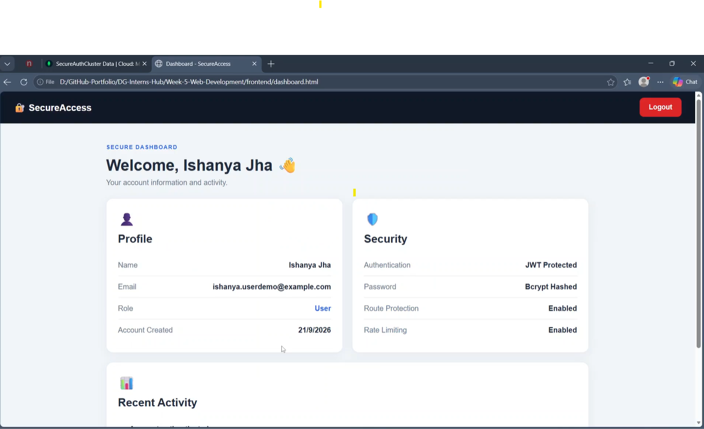
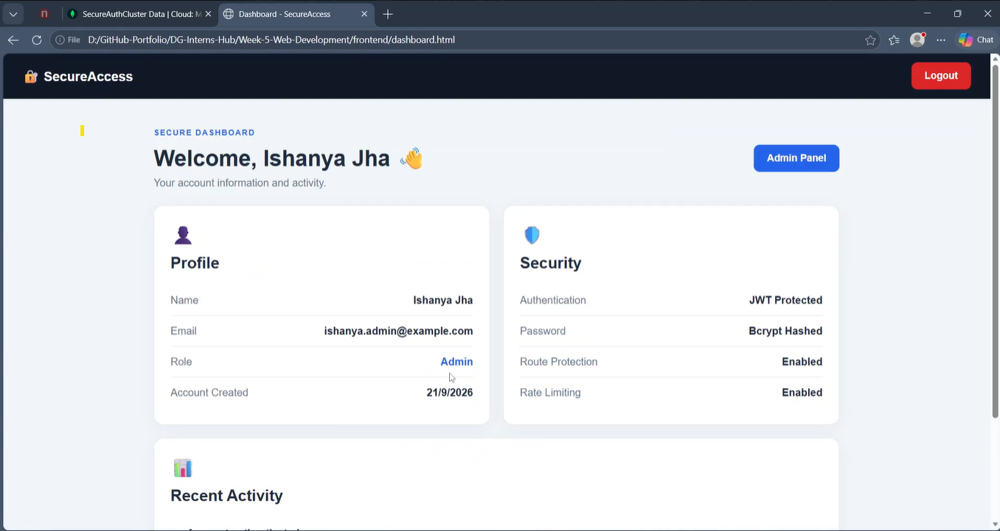
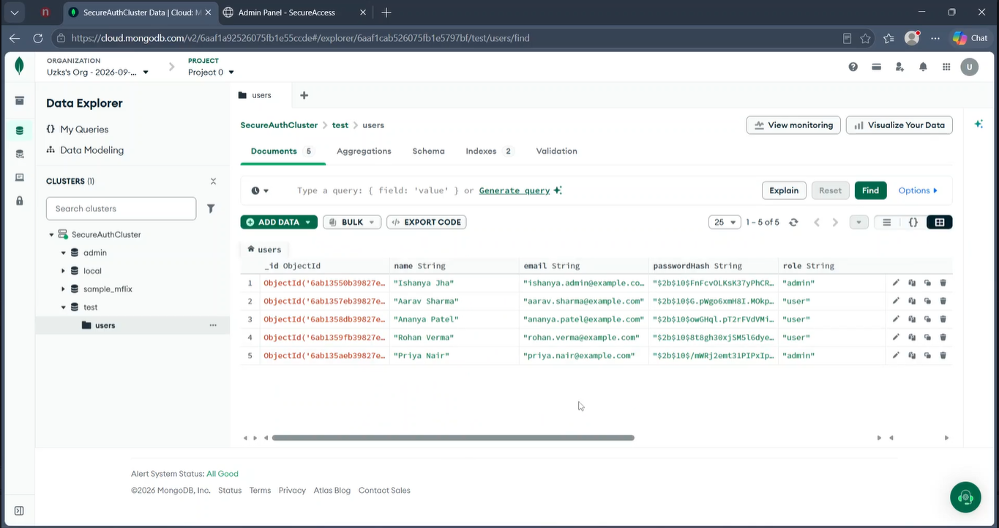

# SecureAccess – Secure Full-Stack Authentication System & Admin Dashboard

## 📌 Project Overview

**SecureAccess** is a secure full-stack web application developed as part of my **Week 5 Web Development Internship at DG Interns Hub**.

The project demonstrates user registration, authentication, authorization, secure password handling, MongoDB database integration, protected routes, role-based access control, and administrative user management.

---

## 👨‍💻 Internship Details

* **Intern Name:** Ishanya Jha
* **Intern ID:** DG/AUGUST/WEB/037
* **Batch:** 1
* **Week:** 5
* **Project:** SecureAccess
* **Category:** Web Development

---

## 🚀 Features

### 👤 User Features

* User registration
* User login
* Secure password hashing
* JWT-based authentication
* Protected user dashboard
* User profile information
* Recent activity display
* User logout

### 🛡️ Security Features

* Password hashing using **bcrypt**
* JWT-based authentication
* Protected API routes
* Role-based authorization
* Admin-only routes
* Authentication rate limiting
* Input validation
* Secure password storage
* Helmet security middleware
* CORS configuration
* Password hash excluded from API responses

### 👑 Admin Features

* Admin authentication
* View registered users
* Search users
* View user roles
* Update user roles through the database
* Delete user accounts
* Confirmation before deleting users

---

## 🛠️ Technologies Used

### Frontend

* HTML5
* CSS3
* JavaScript

### Backend

* Node.js
* Express.js

### Database

* MongoDB
* Mongoose

### Authentication & Security

* JSON Web Token (JWT)
* bcryptjs
* Helmet
* Express Rate Limit
* CORS

---

## 📂 Project Structure

```text
Week-5-Web-Development/
│
├── backend/
│   ├── config/
│   │   └── db.js
│   │
│   ├── controllers/
│   │   ├── authController.js
│   │   └── userController.js
│   │
│   ├── middleware/
│   │   ├── authMiddleware.js
│   │   ├── adminMiddleware.js
│   │   └── rateLimiter.js
│   │
│   ├── models/
│   │   └── User.js
│   │
│   ├── routes/
│   │   ├── authRoutes.js
│   │   └── userRoutes.js
│   │
│   ├── .gitignore
│   ├── package.json
│   ├── package-lock.json
│   └── server.js
│
├── frontend/
│   ├── index.html
│   ├── login.html
│   ├── signup.html
│   ├── dashboard.html
│   ├── admin.html
│   ├── style.css
│   └── script.js
│
├── images/
│   ├── signup.png
│   ├── login.png
│   ├── dashboard.png
│   ├── admin-dashboard.png
│   └── mongodb-users.png
│
└── README.md
```

---

## 🔐 Authentication Workflow

The application follows this basic authentication flow:

```text
User
  ↓
Signup
  ↓
Backend Validation
  ↓
Password Hashing with bcrypt
  ↓
MongoDB
  ↓
Login
  ↓
Credential Verification
  ↓
JWT Generation
  ↓
Protected Dashboard
```

For administrator accounts:

```text
Admin Login
     ↓
JWT Verification
     ↓
Role Verification
     ↓
Admin Dashboard
     ↓
User Management
```

---

## 🗄️ Database

The application uses **MongoDB** to store user information.

Each user document contains fields such as:

```text
_id
name
email
passwordHash
role
createdAt
updatedAt
```

Passwords are stored as bcrypt hashes instead of plain-text passwords.

The application uses the `role` field to distinguish between normal users and administrators.

---

## 🔒 Security Implementation

SecureAccess implements multiple security mechanisms:

### Password Hashing

User passwords are hashed using **bcryptjs** before being stored in MongoDB.

### JWT Authentication

After successful login, the backend generates a JSON Web Token containing the authenticated user's identity and role.

### Protected Routes

Authentication middleware verifies the JWT before allowing access to protected resources.

### Role-Based Authorization

Administrative routes verify that the authenticated user has the required `admin` role.

### Rate Limiting

Authentication endpoints use rate limiting to restrict repeated login and signup attempts.

### Security Headers

Helmet is used to add security-related HTTP headers.

### XSS Protection

Frontend user-generated values are rendered using safe DOM methods such as `textContent` instead of directly inserting untrusted HTML.

---

## ▶️ Running the Project Locally

### 1. Clone the Repository

```bash
git clone https://github.com/Ishanya-Jha/DG-Interns-Hub.git
```

### 2. Open the Week 5 Backend

```bash
cd DG-Interns-Hub/Week-5-Web-Development/backend
```

### 3. Install Dependencies

```bash
npm install
```

### 4. Configure Environment Variables

Create a `.env` file inside the `backend` folder:

```env
MONGO_URI=your_mongodb_connection_string
JWT_SECRET=your_jwt_secret
PORT=5000
```

**Never upload the `.env` file to GitHub.**

### 5. Start the Backend

```bash
node server.js
```

The backend will run at:

```text
http://localhost:5000
```

### 6. Open the Frontend

Open:

```text
frontend/index.html
```

in your browser.

---

## 📸 Project Screenshots

### User Signup



### User Login



### User Dashboard



### Admin Dashboard



### MongoDB Users Collection



---

## 🎯 Learning Outcomes

Through this project, I strengthened my understanding of:

* Full-stack web application development
* Frontend and backend integration
* REST API development
* User authentication
* JWT-based authorization
* Password hashing
* MongoDB database operations
* Express middleware
* Role-based access control
* Web application security
* Admin dashboard development
* CRUD operations

---

## 📚 Internship

This project was completed as part of the **Web Development Internship at DG Interns Hub, Batch 1**.

The project helped me apply concepts from frontend development, backend development, database management, authentication, and web security in a practical application.

---

## 🔗 Repository

**GitHub Repository:**

https://github.com/Ishanya-Jha/DG-Interns-Hub/tree/main/Week-5-Web-Development

---

## 👩‍💻 Developer

**Ishanya Jha**

Web Development Intern
DG Interns Hub – Batch 1
