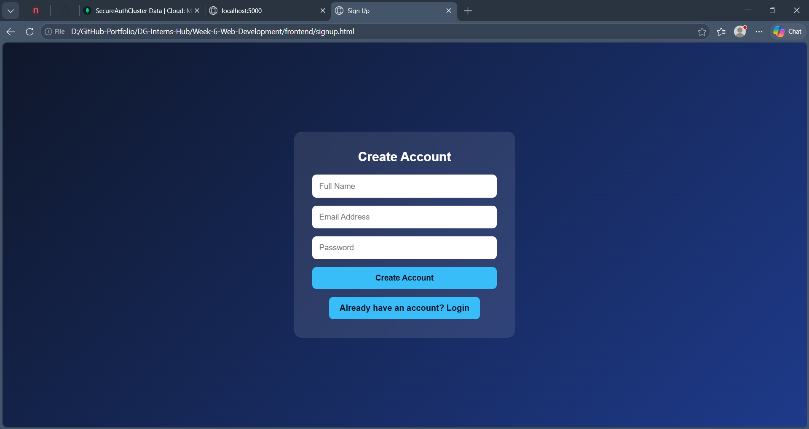
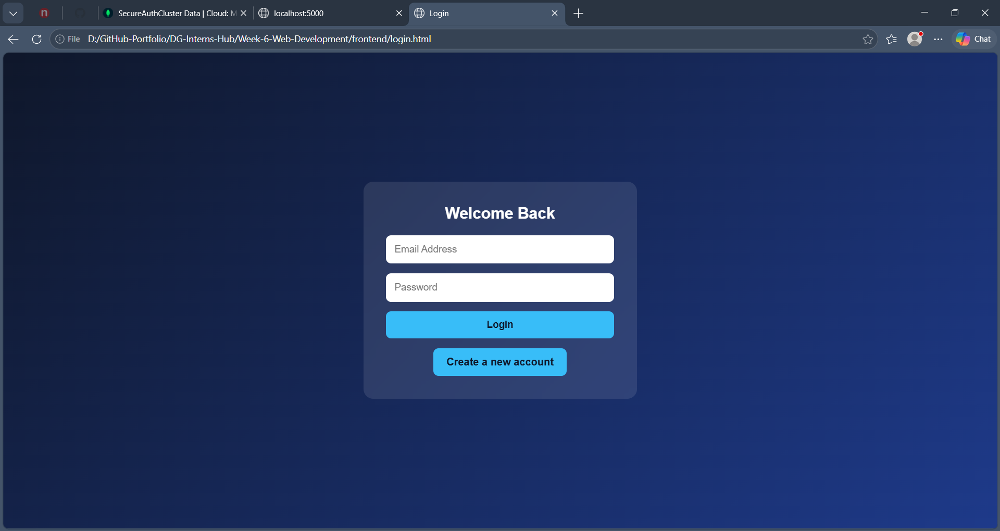
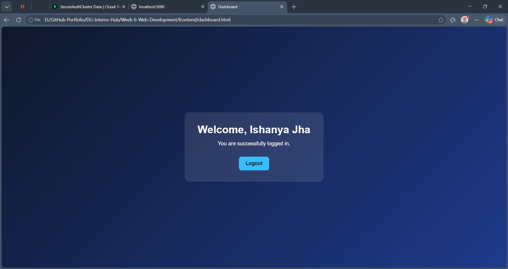
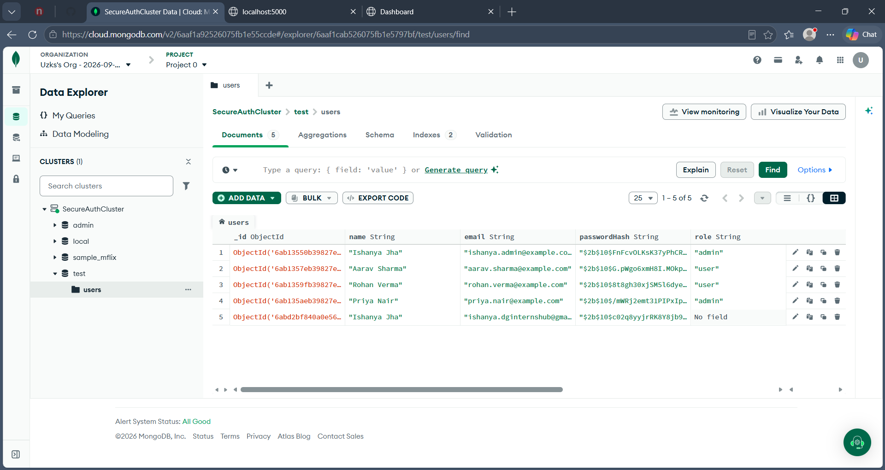

# Week 6 – Backend Integration & Authentication System

## SecureLogin – Secure Full-Stack Authentication System

A full-stack authentication system developed as part of the **DG Interns Hub Web Development Internship – Week 6**.

The project demonstrates frontend and backend integration with user registration, login authentication, password hashing, JWT-based authentication, MongoDB database integration, protected dashboard access, and logout functionality.

---

## 📌 Project Overview

**SecureLogin** is a simple full-stack authentication application where users can:

* Create an account
* Register using name, email, and password
* Store user information securely in MongoDB
* Login using registered credentials
* Authenticate using JSON Web Tokens (JWT)
* Access a protected dashboard
* View their personalized welcome message
* Logout securely
* Receive validation and error messages

The project was developed to understand how a frontend application communicates with a backend API and how authentication data is stored and verified using a database.

---

## 🎯 Objectives

The main objectives of this project were:

1. Understand frontend and backend integration.
2. Build a complete user signup system.
3. Build a secure login system.
4. Store user data in MongoDB.
5. Hash passwords using bcrypt.
6. Implement JWT-based authentication.
7. Protect authenticated routes using middleware.
8. Implement logout functionality.
9. Handle validation and authentication errors.
10. Understand the complete authentication flow from frontend to database.

---

# 🛠️ Technology Stack

## Frontend

* HTML5
* CSS3
* JavaScript
* Fetch API
* Local Storage

## Backend

* Node.js
* Express.js
* REST API

## Database

* MongoDB
* MongoDB Atlas
* Mongoose

## Authentication & Security

* bcryptjs
* JSON Web Token (JWT)
* Authentication Middleware
* Environment Variables
* Duplicate Email Prevention
* Input Validation

## Development Tools

* Visual Studio Code
* Git
* GitHub
* MongoDB Atlas
* VS Code Live Server

---

# 📂 Project Structure

```text
Week-6-Web-Development/
│
├── backend/
│   │
│   ├── config/
│   │   └── db.js
│   │
│   ├── middleware/
│   │   └── authMiddleware.js
│   │
│   ├── models/
│   │   └── User.js
│   │
│   ├── routes/
│   │   └── authRoutes.js
│   │
│   ├── .gitignore
│   ├── package.json
│   ├── package-lock.json
│   └── server.js
│
├── frontend/
│   ├── index.html
│   ├── signup.html
│   ├── login.html
│   ├── dashboard.html
│   ├── script.js
│   └── style.css
│
├── images/
│   ├── Signup.png
│   ├── Login.png
│   ├── Dashboard.png
│   └── MongoDB.png
│
└── README.md
```

---

# 🔐 Authentication Flow

The application follows this authentication flow:

```text
User
  │
  ▼
Signup Page
  │
  ▼
Frontend JavaScript
  │
  ▼
Express API
  │
  ▼
Input Validation
  │
  ▼
Duplicate Email Check
  │
  ▼
bcrypt Password Hashing
  │
  ▼
MongoDB
```

For login:

```text
User
  │
  ▼
Login Page
  │
  ▼
Frontend JavaScript
  │
  ▼
Express Login API
  │
  ▼
Find User in MongoDB
  │
  ▼
Compare Password using bcrypt
  │
  ▼
Generate JWT
  │
  ▼
Store Token in Browser
  │
  ▼
Protected Dashboard
```

---

# 👤 User Registration

The signup page collects:

* Full Name
* Email Address
* Password

The frontend sends the information to:

```text
POST /api/auth/signup
```

The backend performs:

1. Required field validation
2. Name validation
3. Email format validation
4. Password length validation
5. Duplicate email checking
6. Password hashing using bcrypt
7. User creation in MongoDB

The original password is **never stored as plain text**.

---

# 🔑 User Login

The login page accepts:

* Email
* Password

The frontend sends the credentials to:

```text
POST /api/auth/login
```

The backend:

1. Finds the user using the email.
2. Compares the entered password with the stored bcrypt hash.
3. Rejects invalid credentials.
4. Generates a JWT when authentication succeeds.
5. Sends the token to the frontend.

The authenticated user is then redirected to the dashboard.

---

# 🛡️ JWT Authentication

JSON Web Token (JWT) is used to authenticate users after successful login.

The token contains the user's ID and is signed using a secret key stored in the environment configuration.

Example token payload:

```text
{
    userId: "user_id"
}
```

The JWT is configured to expire after a limited period.

The authentication middleware checks the token before allowing access to protected backend routes.

---

# 🚪 Protected Dashboard

The dashboard is intended for authenticated users only.

After successful login, the application stores the authentication token and user information in the browser.

The dashboard displays:

```text
Welcome, Ishanya
You are successfully logged in.
```

If authentication information is not available, the user is redirected to the login page.

The backend also contains a protected dashboard API:

```text
GET /api/dashboard
```

This route uses authentication middleware to verify the JWT.

---

# 🚪 Logout

When the user clicks **Logout**:

* JWT token is removed from browser storage.
* Stored user information is removed.
* The user is redirected to the login page.

This prevents the previous authentication session from being reused through the stored browser data.

---

# 🗄️ Database

MongoDB is used as the project's database.

Mongoose provides the connection between the Node.js application and MongoDB.

The user schema contains:

```text
name
email
passwordHash
createdAt
updatedAt
```

Example database record:

```text
{
    name: "Ishanya",
    email: "user@example.com",
    passwordHash: "$2b$10$...",
    createdAt: "...",
    updatedAt: "..."
}
```

The `passwordHash` field contains the bcrypt-generated hash rather than the original password.

---

# 🔒 Security Features

The project implements several basic security practices:

### Password Hashing

Passwords are hashed using:

```text
bcryptjs
```

### Duplicate Email Prevention

The backend checks whether an email is already registered before creating a new account.

### Input Validation

The application validates:

* Required fields
* Email format
* Minimum password length
* Name length

### JWT Authentication

JWT is used to authenticate users after successful login.

### Protected API

The dashboard API requires a valid JWT.

### Environment Variables

Database connection information and JWT configuration are stored using `.env`.

The `.env` file is excluded from Git using `.gitignore`.

---

# 🔌 API Endpoints

## 1. Signup

```text
POST /api/auth/signup
```

### Request

```json
{
    "name": "Ishanya",
    "email": "user@example.com",
    "password": "password123"
}
```

### Response

```json
{
    "message": "Account created successfully",
    "user": {
        "id": "...",
        "name": "Ishanya",
        "email": "user@example.com"
    }
}
```

---

## 2. Login

```text
POST /api/auth/login
```

### Request

```json
{
    "email": "user@example.com",
    "password": "password123"
}
```

### Response

```json
{
    "message": "Login successful",
    "token": "...",
    "user": {
        "id": "...",
        "name": "Ishanya",
        "email": "user@example.com"
    }
}
```

---

## 3. Protected Dashboard

```text
GET /api/dashboard
```

This endpoint requires a valid JWT authentication token.

Example authorization header:

```text
Authorization: Bearer YOUR_JWT_TOKEN
```

---

# 📸 Screenshots

## Signup Page

The signup page allows a new user to create an account using their name, email, and password.



---

## Login Page

The login page authenticates registered users using their email and password.



---

## User Dashboard

After successful authentication, the user is redirected to the protected dashboard.



---

## MongoDB Users Collection

The registered user is stored in the MongoDB collection with a hashed password.



---

# ⚙️ Installation & Setup

## Prerequisites

Before running the project, install:

* Node.js
* npm
* MongoDB Atlas account
* Visual Studio Code
* Git

Node.js includes npm, so installing Node.js provides both tools.

---

# 📥 Step 1 – Clone the Repository

Clone the GitHub repository:

```bash
git clone https://github.com/Ishanya-Jha/DG-Interns-Hub.git
```

Move into the project:

```bash
cd DG-Interns-Hub/Week-6-Web-Development
```

---

# 📦 Step 2 – Install Backend Dependencies

Open the backend directory:

```bash
cd backend
```

Install the required packages:

```bash
npm install
```

The main dependencies include:

* express
* mongoose
* bcryptjs
* jsonwebtoken
* cors
* dotenv

---

# 🗄️ Step 3 – Configure MongoDB

Create or use a MongoDB Atlas cluster.

Obtain the MongoDB connection string from MongoDB Atlas.

Inside the `backend` folder, create:

```text
.env
```

Add:

```env
MONGO_URI=YOUR_MONGODB_CONNECTION_STRING
JWT_SECRET=YOUR_SECRET_KEY
PORT=5000
```

### Important

Do not commit the `.env` file to GitHub.

The project already includes:

```text
.env
```

inside the backend `.gitignore`.

---

# 🌐 Step 4 – Configure MongoDB Network Access

In MongoDB Atlas:

```text
Security
   ↓
Network Access
   ↓
Add IP Address
   ↓
Add My Current IP Address
```

This allows your development machine to connect to the MongoDB Atlas cluster.

---

# ▶️ Step 5 – Start the Backend

From the backend directory:

```bash
node server.js
```

A successful startup should display:

```text
Server running on http://localhost:5000
MongoDB connected successfully
```

---

# 🧪 Step 6 – Test Backend

Open the following URL in your browser:

```text
http://localhost:5000
```

Expected response:

```json
{
    "message": "Week 6 Authentication API is running"
}
```

This confirms that the Express backend is running.

---

# 💻 Step 7 – Run the Frontend

Open the `frontend` folder in Visual Studio Code.

Open:

```text
index.html
```

Run it using **Live Server**.

The application will open in the browser.

From the home page, the user can navigate to:

```text
Create Account
```

or

```text
Login
```

---

# 🧪 Step 8 – Test the Complete Application

Follow this sequence:

### Signup Test

1. Open the Signup page.
2. Enter your name.
3. Enter an email address.
4. Enter a password with at least 6 characters.
5. Click **Create Account**.
6. Verify that the account is created.

Expected message:

```text
Account created successfully
```

---

### Database Test

Open MongoDB Atlas and check the users collection.

The newly registered user should appear with:

```text
name
email
passwordHash
createdAt
updatedAt
```

The password should appear as a bcrypt hash rather than plain text.

---

### Login Test

1. Open Login.
2. Enter the registered email.
3. Enter the registered password.
4. Click Login.

Expected message:

```text
Login successful
```

The user should then be redirected to the dashboard.

---

### Dashboard Test

The dashboard should display:

```text
Welcome, Ishanya
You are successfully logged in.
```

---

### Logout Test

Click:

```text
Logout
```

The user should be redirected to the Login page.

---

# ❌ Error Handling

The application handles common errors such as:

### Missing Fields

```text
All fields are required
```

### Invalid Email

```text
Please enter a valid email address
```

### Short Password

```text
Password must be at least 6 characters
```

### Duplicate Email

```text
Email is already registered
```

### Invalid Login

```text
Invalid email or password
```

### Invalid Authentication

```text
Invalid or expired token
```

### Server Connection Error

```text
Unable to connect to server.
```

---

# 🌍 Live Project

## Current Status

The project is **fully developed and tested locally**, but a public live deployment is **currently not available**.

The backend requires a running Node.js server and MongoDB connection, so the GitHub repository contains the complete source code rather than a publicly hosted application.

### GitHub Repository

https://github.com/Ishanya-Jha/DG-Interns-Hub

### Week 6 Project Folder

https://github.com/Ishanya-Jha/DG-Interns-Hub/tree/main/Week-6-Web-Development

### Live Project

**Deployment is currently in progress.**

The project is fully developed and available on GitHub, and the live version can be deployed using a backend hosting service such as Render and a frontend hosting service such as GitHub Pages or another static hosting platform.

---

# 📚 Learning Outcomes

This project helped me understand:

* Frontend and backend communication
* REST API development
* Express.js routing
* Node.js backend development
* MongoDB database integration
* Mongoose schemas and models
* Password hashing with bcrypt
* JWT authentication
* Authentication middleware
* Protected routes
* API request handling using Fetch
* Browser local storage
* Input validation
* Error handling
* Environment variables
* Git and GitHub workflow
* Full-stack application architecture

---

# 🚀 Future Improvements

Possible future improvements include:

* Forgot Password functionality
* Email verification
* Password reset through email
* Refresh token authentication
* HTTP-only cookies for token storage
* Improved frontend validation
* Responsive UI improvements
* User profile management
* Role-based authorization
* Production deployment
* HTTPS configuration
* More advanced security controls

---

# 📋 Internship Details

**Organization:** DG Interns Hub
**Internship:** Web Development Internship
**Batch:** 1
**Week:** 6
**Intern Name:** Ishanya Jha
**Intern ID:** DG/AUGUST/WEB/037

---

# ✅ Project Completion

The Week 6 Backend Integration & Authentication System has been completed and tested successfully.

The implemented workflow is:

```text
Signup
   ↓
Input Validation
   ↓
bcrypt Password Hashing
   ↓
MongoDB
   ↓
Login
   ↓
Password Verification
   ↓
JWT Generation
   ↓
Protected Dashboard
   ↓
Logout
```

The project demonstrates a complete beginner-friendly full-stack authentication workflow using **HTML, CSS, JavaScript, Node.js, Express.js, MongoDB, Mongoose, bcrypt, and JWT**.
